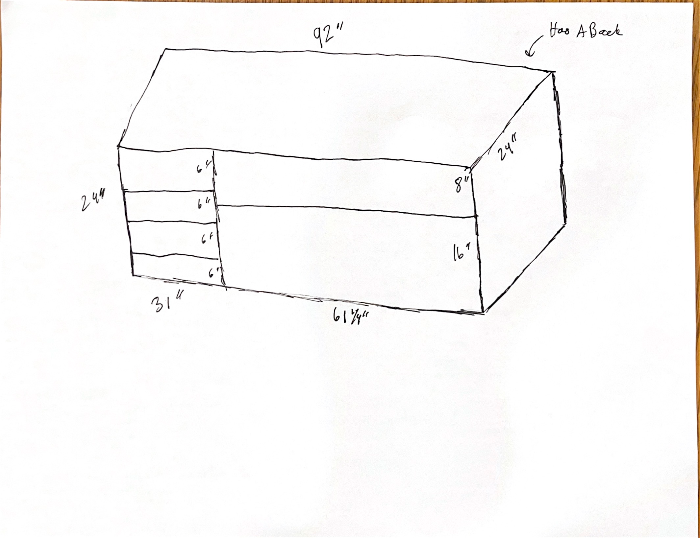
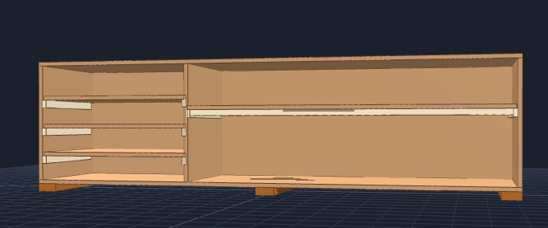
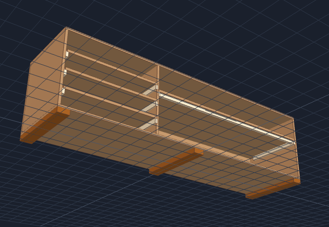

# Chemistry Lab Floor Storage Shelf (Shelf A)



## Complete Step-by-Step DIY Build & Material Guide
### Front View




## View at an anglw showing stiffer bars, Cleats, base skids



---

### Key Specifications

* **Overall Dimensions:** 92" Wide × 23.25" Deep × 25.5" High (24" Body + 1.5" Base Skids [P11])
* **Design Features:** Easy cleat assembly [P10], anti-sag long shelf reinforcement [P9], base elevation skids against
  damp floors [P11], dual-fastened shelves [P7, P8], and chemical-resistant finishing for lab use.
* **Wall Mounting Restriction:** **NO WALL MOUNTING ALLOWED.** This unit is engineered to be strictly free-standing.
  Structural stability, squareness, and anti-racking strength are provided by internal side cleats [P10], base
  skids [P11], and the full 3/4" rear backing panel [P3].

> **NOTE**  
> Do not anchor or screw this shelf into room walls. It must remain fully free-standing. Always build on a flat surface, verify diagonal squareness, and ensure the back panel [P3] is glued and fastened securely to lock the cabinet rigid.

---

### 1. Materials to Buy

#### Lumber & Plywood

| Qty          | Item                                                  | Use                                                                     |
|--------------|-------------------------------------------------------|-------------------------------------------------------------------------|
| **3 Sheets** | 3/4" × 4' × 8' Sanded Plywood (BCX or Sandeply Birch) | Outer frame (P1, P2, P4, P5, P6), back panel (P3), and shelves (P7, P8) |
| **2 Boards** | 1" × 2" × 8' Select Pine Board                        | Long shelf stiffener lip (P9) and side support cleats (P10)             |
| **1 Board**  | 2" × 4" × 8' Construction Pine Board                  | Base skids / feet underneath unit (P11)                                 |

> **Pro Scout Tip:** Ask the store associate at the Home Depot or Lowe's lumber panel saw to rip your 4' × 8' sheets
> into the 23.25" and 24.0" wide strips for free or cheap. This makes transporting the wood much easier and guarantees
> straight cuts!

#### Fasteners, Hardware & Glue

| Qty          | Item                                                  | Use                                                                                                           |
|--------------|-------------------------------------------------------|---------------------------------------------------------------------------------------------------------------|
| **1 Bottle** | Titebond II Wood Glue (16 oz)                         | Primary structural bonding across all wood-to-wood joints (80%+ total strength)                               |
| **1 Box**    | 2" #8 Star-Drive Wood/Cabinet Screws                  | Main assembly fasteners for attaching base skids (P11), top panel (P1), bottom panel (P2), and outer frame    |
| **1 Pack**   | 1-1/4" to 1-1/2" Finish Nails (or 1-1/4" Wood Screws) | Attaching support cleats (P10), stiffener bar (P9), and securing shelves (P7, P8) vertically down into cleats |
| **1 Pack**   | 1-1/2" to 2" Finish Nails (or 1-5/8" Trim Screws)     | Horizontal fastening through exterior side panels (P4, P5) and divider (P6) directly into shelf end cores     |
| **1 Pack**   | 1" to 1-1/4" Brad Nails or Wood Screws                | Mounting the 3/4" rear back panel (P3) around perimeter and center divider                                    |
| **1 Bit**    | 1/8" Countersink Drill Bit Combination                | Pre-drilling pilot holes and recessing screw heads flush without splitting plywood                            |

#### Lab-Grade Paint & Finishing

| Qty          | Item                                           | Use                                                                                   | Priority  |
|--------------|------------------------------------------------|---------------------------------------------------------------------------------------|-----------|
| **1 Quart**  | Latex Wood Primer                              | Seals raw plywood edges and surfaces prior to paint application                       | Mandatory |
| **1 Gallon** | Semi-Gloss or Gloss Interior Enamel Paint      | Smooth, washable body finish resisting water and chemical splashes                    | Mandatory |
| **1 Quart**  | Water-Based Polyurethane (Clear)               | Tough clear coat over top working surface and shelf tops for scratch/stain protection | Optional  |
| **1 Pack**   | 120-Grit Sandpaper + 4" Foam Rollers & Brushes | Surface sanding and smooth paint/sealer application                                   | Mandatory |

---

### 2. Master Cut List

| PartId  | Part Name         | Qty | Material       | Cut Dimensions (W × D or H) | Function / Location                                           |
|---------|-------------------|-----|----------------|-----------------------------|---------------------------------------------------------------|
| **P1**  | Top Panel         | 1   | 3/4" Plywood   | $92.00'' \times 23.25''$    | Top exterior cover cap                                        |
| **P2**  | Bottom Panel      | 1   | 3/4" Plywood   | $92.00'' \times 23.25''$    | Bottom exterior base                                          |
| **P3**  | Back Panel        | 1   | 3/4" Plywood   | $92.00'' \times 24.00''$    | Full rear panel (locks box square; eliminates wall anchoring) |
| **P4**  | Left Side Panel   | 1   | 3/4" Plywood   | $22.50'' \times 23.25''$    | Left outer wall                                               |
| **P5**  | Right Side Panel  | 1   | 3/4" Plywood   | $22.50'' \times 23.25''$    | Right outer wall                                              |
| **P6**  | Center Divider    | 1   | 3/4" Plywood   | $22.50'' \times 23.25''$    | Main vertical divider                                         |
| **P7**  | Long Shelf        | 1   | 3/4" Plywood   | $60.25'' \times 23.25''$    | Horizontal shelf for right section                            |
| **P8**  | Small Shelves     | 3   | 3/4" Plywood   | $29.50'' \times 23.25''$    | Horizontal shelves for left section                           |
| **P9**  | Shelf Stiffener   | 1   | 1x2 Pine Board | **$60.25'' \times 1.50''$** | Aligned flush under front edge of Long Shelf (P7)             |
| **P10** | Shelf Cleats      | 8   | 1x2 Pine Board | **$20.00'' \times 1.50''$** | Support ledges mounted on inside side/divider walls           |
| **P11** | Base Skids (Feet) | 3   | 2x4 Lumber     | **$23.25'' \times 3.50''$** | Floor elevation skids mounted under bottom panel (P2)         |

---

### 3. Sheet & Lumber Cutting Plan

```text
PLYWOOD SHEET 1 (48" x 96" x 3/4")
+-----------------------------------------------------------------------------------------+
|                        [P1] Top Panel: 92.0" x 23.25"                       | Remainder |
+-----------------------------------------------------------------------------------------+
|                       [P2] Bottom Panel: 92.0" x 23.25"                     | Remainder |
+-----------------------------------------------------------------------------------------+

PLYWOOD SHEET 2 (48" x 96" x 3/4")
+-----------------------------------------------------------------------------------------+
|                        [P3] Back Panel: 92.0" x 24.00"                      | Remainder |
+-----------------------------------------------------------------------------------------+
|       [P7] Long Shelf: 60.25" x 23.25"       |   [P8a] Small Shelf 1: 29.5"   | Remainder |
+-----------------------------------------------------------------------------------------+

PLYWOOD SHEET 3 (48" x 96" x 3/4")
+-----------------------------------------------------------------------------------------+
|   [P8b] Small Shelf 2: 29.5"  |   [P8c] Small Shelf 3: 29.5"  |         Scrap           |
+-----------------------------------------------------------------------------------------+
| [P4] Left Side: 22.5"     | [P5] Right Side: 22.5"    | [P6] Center Divider: 22.5" | Scrap |
+-----------------------------------------------------------------------------------------+

1x2 PINE BOARD #1 (Lip)   : Cut 1 piece @ 60.25" long [P9] (Stiffener Lip) + 35.75" Scrap
1x2 PINE BOARD #2 (Cleats): Cut 8 pieces @ 20.00" long [P10] (Support Cleats)
2x4 PINE BOARD (Skids)   : Cut 3 pieces @ 23.25" long [P11] (Floor Base Feet)

```

---

### 4. Visual Construction Diagrams

#### Diagram A: Long Shelf Stiffener Lip (End Cross-Section View)

Attaching a vertical 1x2 pine board [P9] (cut to the full 60.25" length) flush under the front edge of the long
shelf [P7] creates an upside-down "L" beam that eliminates sagging under heavy chemistry gear.

```text
                    SIDE VIEW (Looking down the side edge of the shelf)

                       Front Edge                               Back Edge
                            |                                       |
                            v                                       v
                    +---------------+---------------------------------------+
                    |           [P7] 3/4" Plywood Long Shelf                |  <-- Horizontal top
                    +-------+-------+---------------------------------------+
                            |       |
                            | [P9]  |
                            | 1x2   |  <-- Vertical leg (hangs down 1.5 inches;
                            | Lip   |      aligned flush with front edge)
                            +-------+

```

#### Diagram B: Side Panel Support Cleat Placement (Side View of Interior Panels)

```text
LEFT SECTION WALLS (Inside [P4] Left Side Panel & Left Face of [P6] Center Divider)
+-------------------------------------------------------------------------+ (Top Edge: 22.5" High)
|                                                                         |
|       [================== [P10] Cleat 3 ==================]             | <-- Top edge at 16.5"
|                                                                         |
|       [================== [P10] Cleat 2 ==================]             | <-- Top edge at 11.0"
|                                                                         |
|       [================== [P10] Cleat 1 ==================]             | <-- Top edge at 5.5"
|                                                                         |
+-------------------------------------------------------------------------+ (Bottom Edge)
| 3.25" Gap |<------------------- 20.0" Long Cleat ---------------------->|
 (Front Edge)                                                              (Back Edge)

RIGHT SECTION WALLS (Right Face of [P6] Center Divider & Inside [P5] Right Side Panel)
+-------------------------------------------------------------------------+ (Top Edge: 22.5" High)
|                                                                         |
|       [================== [P10] Long Shelf Cleat =========]             | <-- Top edge at 14.5"
|                                                                         |
+-------------------------------------------------------------------------+ (Bottom Edge)
| 3.25" Gap |<------------------- 20.0" Long Cleat ---------------------->|

```

#### Diagram C: Cabinet Assembly Layout (Exploded Front View)

```text
                       ======================================= [[P1] Top Panel: 92" x 23.25"]
                      ||                                     ||
   +------------------++--------------------+----------------++-------------------+
   |                  || [P8a] Small Shelf 1|                ||                   |
   |                  ||====================|                || [P7] Long Shelf   |
   | [P4] Left Side   || [P10]      [P10]   || [P6] Center   ||===================| <-- [[P9] 1x2 Stiffener Lip]
   | Panel            || [P8b] Small Shelf 2| Divider        || [P10]       [P10] |
   | (22.5" x 23.25") ||====================| (22.5"x23.25") ||                   |
   |                  || [P10]      [P10]   ||                || [P5] Right Side  |
   |                  || [P8c] Small Shelf 3|                || Panel             |
   |                  ||====================|                || (22.5" x 23.25")  |
   |                  || [P10]      [P10]   ||                ||                   |
   +------------------++--------------------+----------------++-------------------+
                      ||                                     ||
                       ======================================= [[P2] Bottom Panel: 92" x 23.25"]
                           | |                   | |                 | |
                          [P11]                 [P11]               [P11]  <-- [[P11] 2x4 Base Elevation Skids]

```

---

### 5. Step-by-Step Build Instructions

#### Step 1: Prepare Long Shelf Stiffener Lip

1. Lay the **Long Shelf [P7]** ($60.25'' \times 23.25''$) flat on your workbench bottom-side up.
2. Cut a piece of 1x2 pine board **[P9]** to **exactly $60.25''$ long** so it spans the complete width of the shelf.
3. Align **P9** on its narrow edge **flush against the front edge** on the underside of **P7** (forming an inverted "L"
   beam profile).
4. Apply wood glue along the contact joint, clamp in place, and drive **1-1/4" to 1-1/2" finish nails** (or pre-drill
   with a 1/8" countersink bit and drive 1-1/4" wood screws) vertically down through the top face of **P7** into **P9**
   every 6 to 8 inches. Wipe away glue squeeze-out.

#### Step 2: Attach 2x4 Base Skids (Floor Water & Moisture Protection)

1. Lay the **Bottom Panel [P2]** ($92'' \times 23.25''$) flat on the floor face down.
2. Cut three $23.25''$ long 2x4 pieces **[P11]** (Base Skids). Place one flush at the far left edge, one in the exact
   middle under the center divider line, and one flush at the far right edge (running front-to-back).
3. Apply wood glue between **P11** skids and **P2** plywood. Pre-drill with your 1/8" countersink bit and drive **2" #8
   wood screws** through **P2** into **P11** (4 screws per skid).
4. *Function:* Elevates **P2** 1.5" off damp chemistry lab floors, preventing mopping water, puddles, and chemical
   cleaners from soaking into the wood core while making the unit easier to slide into place.

#### Step 3: Mount Side Support Cleats (The Easy Assembly Method)

1. Measure from the bottom edge of your vertical wall panels (**P4**, **P5**, **P6** inside faces only—**no wall
   mounting to room walls**) and draw horizontal guidelines:

* **Left Side Panel [P4] & Left Face of Center Divider [P6]:** Draw lines at **$5.5''$**, **$11.0''$**, and **$16.5''$**
  from the bottom.
* **Right Side Panel [P5] & Right Face of Center Divider [P6]:** Draw a line at **$14.5''$** from the bottom.


2. Position a $20''$ long 1x2 cleat **[P10]** *just below each line*, pushing the cleat flush against the rear edge (
   leaving a $3.25''$ space at the front).
3. Apply wood glue behind each cleat **[P10]**, pre-drill pilot holes, and secure with **1-1/4" finish nails or 1-1/4"
   wood screws** (3 fasteners per cleat).

#### Step 4: Assemble Interior Shelves & Frame (Dual-Fastening Method)

1. Stand the **Left Side Panel [P4]**, **Center Divider [P6]**, and **Right Side Panel [P5]** vertically.
2. Slide the 3 **Small Shelves [P8]** ($29.5''$) and 1 **Long Shelf [P7]** ($60.25''$) into position so they rest
   directly on top of the mounted interior support cleats **[P10]**.
3. Apply wood glue along all cleat and side wall contact joints.
4. **Fasten Shelves (Dual-Fastening Rule):**

* **Vertical Cleat Fastening:** Drive **1-1/4" to 1-1/2" finish nails** (or 1-1/4" screws) vertically down through the
  top face of shelves (**P7**, **P8**) into the 1x2 support cleats **[P10]** below (3 fasteners per cleat).
* **Horizontal Side Fastening:** Drive **1-1/2" to 2" finish nails** (or 1-5/8" trim screws) horizontally through
  exterior side panels (**P4**, **P5**) and divider **[P6]** directly into the center edge cores of the shelf boards (
  2–3 fasteners per shelf side).

#### Step 5: Attach Top, Bottom & Back Panels (Free-Standing Rigidity)

1. Apply wood glue to all top edges of the assembled vertical walls (**P4**, **P5**, **P6**).
2. Place the **Top Panel [P1]** ($92'' \times 23.25''$) squarely on top, pre-drill, and secure with **2" wood screws**
   into vertical panel edges (3 screws per wall).
3. Apply glue to all bottom edges, set the frame onto the **Bottom Panel [P2]** (with attached **P11** skids), and
   secure with **2" wood screws** driven from inside down into **P2**.
4. Lay the entire cabinet face down. Measure diagonally corner-to-corner to verify the frame is perfectly square.
5. Apply wood glue around the full rear perimeter and center divider edge.
6. Set the **Back Panel [P3]** ($92'' \times 24''$) flush over the rear face. Pre-drill and drive **1" to 1-1/4" brad
   nails or screws** every 6 to 8 inches around the perimeter and center divider. *This rear panel locks the frame
   square and provides the structural stability required so the shelf stays completely rigid without any wall mounting.*

#### Step 6: Sanding & Lab Chemical-Proof Finishing

1. Sand all outer corners, exposed edges, and screw locations with 120-grit sandpaper until completely smooth to prevent
   splinters.
2. Wipe away all wood dust thoroughly with a damp rag.
3. Apply **1 coat of Latex Interior Wood Primer** to all surfaces and let dry for 2 hours.
4. Apply **2 coats of Semi-Gloss or Gloss Interior Enamel Paint** (or Oil-Based/Epoxy Enamel), allowing full dry time
   between coats.
5. Apply **1 to 2 coats of Clear Water-Based Polyurethane** over the top surface and shelf tops to lock out water,
   chemical splashes, and scratches.

---

> **NOTE** When fully assembled, three sheets of 3/4" plywood weigh approximately 160 lbs!
> Assemble this shelf unit inside or right next to the chemistry lab room where it will stay. Always have 3 to 4 Scouts
> work together when lifting, moving, or flipping the cabinet frame.