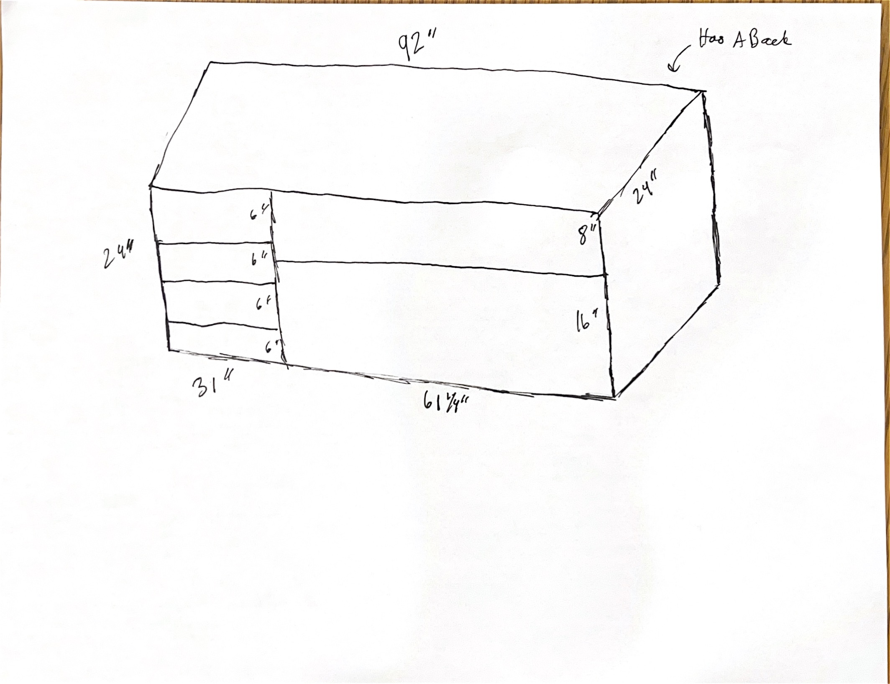

Here is a detailed breakdown, material cut list, and assembly guide based on your sketch.


---

## Technical Assessment & Recommendations

* **Shelf Thickness Caution:** Using **7/16" plywood** for shelves can work for the small **31" left-side drawers/shelves**, but for the **61 ¼" wide shelf**, 7/16" will **sag under weight over time**.
* *Recommendation:* Apply a **1" to 1 ½" solid wood face frame or edge banding strip** directly underneath the front edge of the wide 61 ¼" shelf to act as a structural stiffener, or stick with 3/4" plywood for that specific long span.


---

## 1. Cut List & Cut Diagram Plan (8' x 4' / 96" x 48" Sheets)

*(Note: Standard sheet size is 96" long x 48" wide. Saw blades consume ~1/8" per cut.)*

### **Sheet 1: Outer Shell (3/4" Plywood - 4' x 8')**

1. **Top Panel:** $92'' \times 24''$
2. **Bottom Panel:** $92'' \times 24''$

### **Sheet 2: Sides, Vertical Divider & Shelf (3/4" Plywood - 4' x 8')**

1. **Left Outer Side Panel:** $24'' \times 24''$
2. **Right Outer Side Panel:** $24'' \times 24''$
3. **Vertical Center Divider:** $24'' \times 22.5''$ *(accounts for top/bottom 3/4" thickness)*
4. **Long Right Shelf (61 ¼" section):** $61 \frac{1}{4}'' \times 24''$ *(using 3/4" here prevents sagging)*

### **Sheet 3: Left Shelves / Drawers & Back (7/16" Plywood - 4' x 8')**

1. **4x Left Shelves / Drawer Sections:** $31'' \times 24''$ (each)
2. **Back Panel:** $92'' \times 24''$

---

## 2. Complete Material & Shopping List

### **Lumber**

* **3/4" x 4' x 8' Sanded Hardwood Plywood:** **2 Sheets** (For outer box & wide shelf)
* **7/16" x 4' x 8' Sanded Plywood:** **1 Sheet** (For small shelves & back panel)
* **1" x 2" x 8' Solid Hardwood Strip (1 Piece):** For reinforcing the 61 ¼" shelf edge and front trim.

### **Hardware & Fasteners**

* **Pocket Hole Screws (1 ¼"):** 1 box (if using a Kreg Jig for clean joints) **OR** **#8 x 2" Wood Screws** (for direct exterior screwing).
* **1" Brad Nails / Tacks:** For securing the 7/16" back panel.
* **PVA Wood Glue:** 1 bottle (Titebond II or similar).

### **Finishing & Edge Banding**

* **Iron-On Veneer Edge Banding (3/4" & 1/2"):** 1 roll (~50 ft) to cover exposed plywood edges before painting.
* **Wood Filler / Spackle:** 1 tub (to fill screw holes and seams).
* **120 & 220 Grit Sandpaper:** For smoothing joints and wood filler.
* **Primer & Paint:** 1 quart shellac/oil-based primer + 1 quart acrylic enamel paint (satin or semi-gloss recommended for shelves).

---

## 3. Home Depot Cutting Order Strategy

When asking Home Depot associates to rip your boards, request **RIP CUTS (lengthwise)** first to get the 24" depth, then **CROSS CUTS** to get individual lengths.

```
+-------------------------------------------------------------------+
|               TOP PANEL: 92" x 24" (3/4")                         |
+-------------------------------------------------------------------+
|             BOTTOM PANEL: 92" x 24" (3/4")                        |
+-------------------------------------------------------------------+
  [Sheet 1 - 3/4" Plywood Cut Layout]

+-------------------------------------------------------------------+
|  LONG SHELF: 61 1/4" x 24"  | SIDE L: 24x24 | SIDE R: 24x24     |
+-----------------------------+-----------------+-------------------+
|  DIVIDER: 24" x 22 1/2"     |  SCRAP / TRIM                       |
+-------------------------------------------------------------------+
  [Sheet 2 - 3/4" Plywood Cut Layout]

+-------------------------------------------------------------------+
|                       BACK PANEL: 92" x 24"                       |
+-------------------------------------------------------------------+
| L. SHELF 1 (31x24) | L. SHELF 2 (31x24) | L. SHELF 3 (31x24) |... |
+-------------------------------------------------------------------+
  [Sheet 3 - 7/16" Plywood Cut Layout]

```

---

## 4. Visual Component Breakdown

```
[OUTER FRAME ASSEMBLY]
  __________________________________________________
 |=================== TOP 92" ======================|
 |                                                  |
 | [SIDE 24"]                                [SIDE] |
 |                                                  |
 |================= BOTTOM 92" =====================|
  --------------------------------------------------

[INTERNAL COMPARTMENTS]
  __________________________________________________
 |           |                                      |
 |  6" Slot  |               8" Slot                |
 |-----------|--------------------------------------|
 |  6" Slot  |                                      |
 |-----------|               16" Slot               |
 |  6" Slot  |                                      |
 |-----------|                                      |
 |  6" Slot  |                                      |
 |___31"_____|_______________61 1/4"________________|

```

---

## 5. Step-by-Step Build & Paint Sequence

1. **Pre-Sand & Edge Band:** Apply iron-on edge banding to the front exposed edges of all cut pieces *before* assembly. Sand smooth with 220-grit.
2. **Build Outer Box:** Connect the Top, Bottom, Left Side, and Right Side using wood glue and 2" screws (countersunk) or pocket holes.
3. **Install Center Divider:** Secure the vertical divider $31''$ in from the inside left wall.
4. **Attach Back Panel:** Apply wood glue to the back edges of the box and nail the $92'' \times 24''$ back panel in place to square the entire unit.
5. **Install Internal Shelves:** Mount the left $31''$ shelves and the right $61 \frac{1}{4}''$ shelf at the specified height intervals ($6''$ increments on left; $8''$ top / $16''$ bottom on right).
6. **Fill & Sand:** Fill all screw holes with wood filler. Sand all filled areas and joint edges flat once dry.
7. **Prime & Paint:** Apply 1 coat of primer, lightly sand with 220-grit once dry, then apply 2 thin coats of your chosen paint.