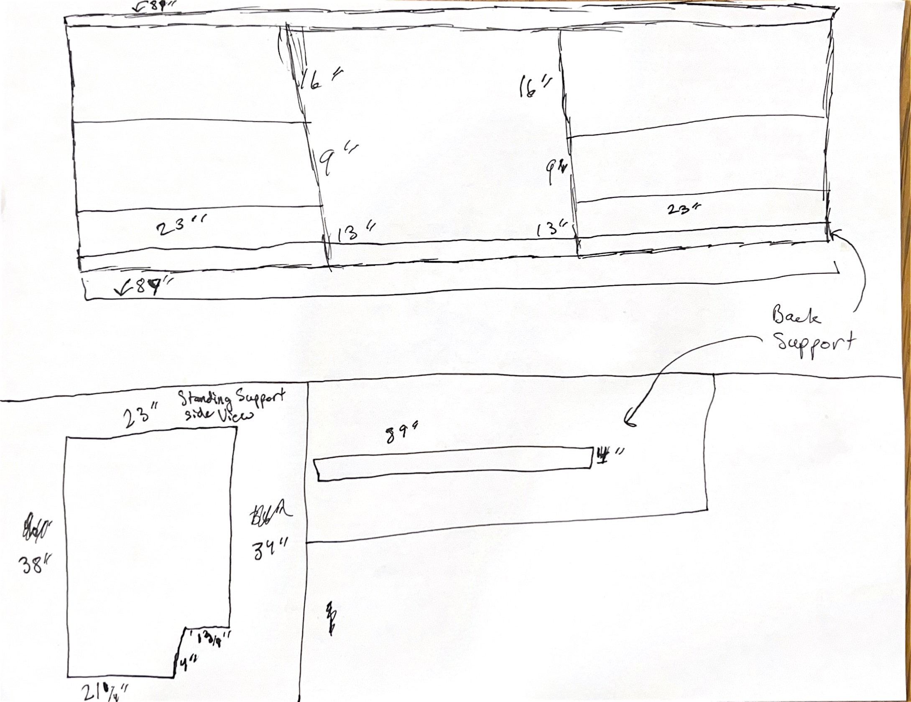

Here is a complete breakdown of your shelf build, optimized for efficiency and minimal waste using standard 4' x 8' plywood sheets!

---

## 1. Material Recommendations & Thickness

* **Main Structure (3/4" Birch/Oak Plywood):** Excellent choice for the outer frame, top, bottom, and main vertical dividers to ensure stability across the 89" total width.
* **Shelves (7/16" or 1/2" Plywood):** * 7/16" plywood works for lighter storage. However, standard cabinet-grade plywood typically comes in **1/2"** rather than 7/16".
* **Pro Tip:** A 23" span with 7/16" or 1/2" wood is moderately sturdy, but to prevent sagging over time, applying solid wood **edge banding (1" to 1.5" tall trim strip)** along the front edge of each shelf acts as a structural stiffener.


---

## 2. Comprehensive Material List

### **Lumber & Sheet Goods**

* **3/4" x 4' x 8' Sanded Hardwood Plywood:** **2 Sheets**
* *For outer panels, top/bottom, center section floor/back, and standing side supports.*


* **1/2" (or 7/16") x 4' x 8' Sanded Plywood:** **1 Sheet**
* *For left and right side adjustable/fixed shelves.*


* **1x2 Solid Wood Trim (or Edge Banding Tape):** **~30 Feet**
* *To cover exposed plywood edges before painting and reinforce 1/2" shelves.*


### **Hardware & Fasteners**

* **Pocket Hole Screws (1-1/4" Pocket Screws):** 1 Box (for 3/4" joints).
* **Wood Screws (1-1/4" and 1-5/8"):** 1 Box each.
* **Brad Nails (1" to 1-1/4"):** For securing edge trim.
* **Shelf Pins/Pegs (5mm or 1/4"):** 1 Pack (if shelf heights are adjustable).

### **Adhesives, Fillers & Prep**

* **Wood Glue (Titebond II or III):** 1 Bottle (16 oz).
* **Wood Filler or Spackle:** 1 Tub (to fill screw holes and wood grain before painting).
* **Sandpaper:** Grit progression (120-grit, 180-grit, 220-grit).

### **Paint & Finishing**

* **Shellac-Based or Oil-Based Primer:** 1 Quart/Gallon (Essential for sealing raw plywood edges and grain).
* **Cabinet-Grade Latex/Enamel Paint:** 1 Gallon (e.g., Benjamin Moore Advance or Sherwin Williams Emerald Urethane).

---

## 3. Cut List & Part Breakdown (Home Depot Ready)

> **Note for Home Depot Cuts:** Store saw blades can be rough. Ask the associate to make major rip cuts (long cuts), but consider making precise crosscuts at home if possible.

```
+-----------------------------------------------------------------------------------+
|                                PARTS VISUAL SUMMARY                               |
|                                                                                   |
|  [ TOP BOARD: 89" x 23" ]                                                         |
|  +-----------------------------------------------------------------------------+  |
|                                                                                   |
|  [ BOTTOM BOARD: 89" x 23" ]                                                      |
|  +-----------------------------------------------------------------------------+  |
|                                                                                   |
|  [ SIDE / VERTICAL SUPPORTS: ~38" x 23" (with notch) ]                             |
|  +----------------+    +----------------+    +----------------+                   |
|  |                |    |                |    |                |                   |
|  +--------+       |    +--------+       |    +--------+       |                   |
|           +-------+             +-------+             +-------+                   |
|                                                                                   |
|  [ BACK SUPPORT: 89" x 4" ]                                                       |
|  +-----------------------------------------------------------------------------+  |
|                                                                                   |
|  [ SHELVES (1/2" Thick): 23" Wide ]                                               |
|  +-----------+  +-----------+  +-----------+  +-----------+                       |
+-----------------------------------------------------------------------------------+

```

### **3/4" Plywood Cuts (Sheet 1 & 2)**

1. **Top Board:** 1 Cut @ $89'' \times 23''$
2. **Bottom Board:** 1 Cut @ $89'' \times 23''$
3. **Outer Side Supports (Left & Right):** 2 Cuts @ $38'' \times 23''$ *(Cut 4" x 13-3/4" notch out at home for standing profile)*
4. **Inner Vertical Dividers:** 2 Cuts @ $34'' \times 23''$
5. **Back Support Cleat:** 1 Cut @ $89'' \times 4''$

### **1/2" Plywood Cuts (Sheet 3)**

1. **Side Shelves (Left & Right Sections):** 4 to 6 Cuts @ $23'' \times 23''$ *(Adjust quantity based on desired shelf count)*

---

## 4. Tips for Painting & Assembly

* **Assemble with Pocket Holes:** Join 3/4" panels using pocket holes on the underside or hidden sides of panels using wood glue for maximum rigidity.
* **Sealing Edges:** Plywood edges absorb paint very quickly. Apply wood filler or iron-on edge banding to raw cut edges before priming. Sand completely smooth.
* **Priming:** Apply **1 coat of stain-blocking primer** followed by **2 coats of cabinet enamel paint**, lightly sanding with 220-grit between coats.